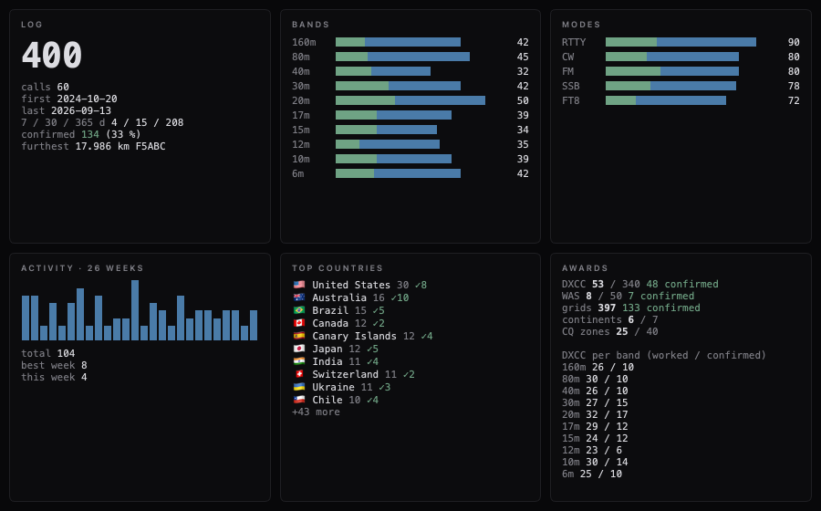

# Logbuch-Kennzahlen + Awards

**Stand:** 18. September 2026
**Anlass:** Punkt 4 der Benchmark-Liste in
[docs/design/2026-09-17-zeus-benchmark.md](../design/2026-09-17-zeus-benchmark.md)
— „Sichtbarster Unterschied im Logbuch; Daten haben wir". Zeus' Logbuch-
Arbeitsplatz zeigt Kacheln für Log / Bänder / Modi / Aktivität (26 Wochen)
/ Top-Länder / Awards (DXCC · WAS · Grids). Longpaths „Stats…" war ein
Monospace-Textfenster mit drei Balkenlisten.

**Maßstab, keine Quelle:** Zeus' Logbuch-Client ist proprietär, sein
GPL-Engine trägt nur die DTOs (`Zeus.Contracts/LogDtos.cs`,
`Zeus.Plugins.Contracts/Extensions/LogbookTypes.cs`) — keine Zählung,
keine Award-Logik. Nichts ist portiert; die Wahl, *was* gezählt wird,
folgt den Kacheln und den Award-Regeln (ARRL DXCC, ARRL WAS).

## Was gebaut wurde

| Datei | Inhalt |
| --- | --- |
| `src/core/LogbookStats.{h,cpp}` | Reine Rechnung über `QVector<LogEntry>`: Gesamt, Rufzeichen, erste/letzte Verbindung, letzte 7/30/365 Tage, Weitester; je Band (Skalenreihenfolge über `AdifLog::bandSortKeyMHz`), je Modus (nach Häufigkeit), je Jahr; 26 Wochen-Eimer; Länder (Entität je Verbindung, absteigend); Awards: DXCC gearbeitet/bestätigt gesamt und je Band, WAS (50 Staaten), Grids (4 Zeichen), Kontinente (7), CQ-Zonen (40). Bestätigt = `QsoConfirmation::isConfirmed` (Karte/LoTW/eQSL Y oder V; R ist eine Bitte). |
| `src/gui/widgets/LogbookStatsWidget.{h,cpp}` | Sechs Kacheln im Idiom von `QsoDetailPane` (Panel-Grund, Versal-Kopf in Skalenfarbe, Monospace für Zahlen); `StatsBarChart` als QPainter-Balken (waagrecht mit Bestätigt-Anteil in Grün, senkrecht für die Wochen). Keine neue Abhängigkeit. Flaggen über `dxccFlagEmoji`. |
| `LogbookWindow::showStatistics` | Öffnet jetzt einen modelosen, wiederverwendeten Dialog mit den Kacheln — über der *gefilterten* Ansicht, wie jeder Export dort; folgt Filter- und Logänderungen, solange er offen ist (`updateStats()` → `refreshStatsView()`). `setCtyDat()` vom `RotorLogbookPanel` (dieselbe Tabelle wie die Karten-Rückfalllösung). |

## Entscheidungen

- **Entitätsschlüssel = cty.dat-Primärpräfix** — derselbe Schlüssel wie
  `DxccWorkedStatus` und die Spot-Farben. cty.dats sechs Nicht-DXCC-Zeilen
  (`*IT9` Sizilien, `*IG9`, `*GM/s` Shetland, `*JW/b` Bäreninsel, `*TA1`
  Europäische Türkei, `*4U1V` Wien) werden in die DXCC-Entität gefaltet,
  für die sie zählen (I, I, GM, JW, TA, OE). „von 340" = Zeilen in cty.dat
  minus diese sechs. Ohne geladene cty.dat zählt das ADIF-Feld `DXCC`
  (`#291`), sonst zählt der Datensatz für keine Entität.
- **WAS:** ARRL-Liste der 50 Staaten; nur Verbindungen mit den drei
  US-Entitäten (K, KL, KH6 bzw. DXCC 291/6/110) und gültigem `STATE`;
  DC zählt als MD (ARRL-Regel); Alaska/Hawaii zählen ohne `STATE` als
  AK/HI.
- **CQ-Zone:** ADIF `CQZ`, sonst der cty.dat-Vorgabewert der Entität;
  Kontinent: ADIF `CONT`, sonst cty.dat.
- **Sprache:** Englisch wie das ganze Logbuchfenster (das „eine Sprache"
  aus dem Erststart-Befund ist eine Gestaltungsentscheidung für alle
  Fenster zusammen, nicht für eine Kachel).
- **Nicht gebaut:** QRZ-Awards-Center mit Credit-Schätzung (2.0.24) —
  bräuchte die QRZ-Logbook-API; Kacheln fest im Start-Arbeitsplatz
  (Benchmark-Punkt 2, Layout = Martins Entscheidung; das Widget ist ein
  einfaches QWidget und kann dorthin).

## Prüfung

`tests/tst_logbook_stats.cpp` (10 Fälle) gegen eine Sieben-Entitäten-
cty.dat: Summen/Daten/Wochen-Eimer, Reihenfolgen, Länder mit Sizilien-
Faltung, DXCC gesamt und je Band, WAS (DC→MD, implizites AK), Grids/
Kontinente/Zonen, ADIF-`DXCC` ohne cty.dat, leeres Log.
`tests/tst_logbook_stats_widget.cpp` (5 Fälle): Kacheln zeigen, was sie
bekommen; 400 synthetische Verbindungen gegen die **echte** cty.dat
(53 Entitäten von 340, Awards aufgelöst, kein `*`-Schlüssel), mit
`LONGPATH_GRAB_DIR` als PNG gerendert; „Stats…" öffnet den Dialog über
der gefilterten Ansicht und folgt dem Suchfeld. Bestehende
`tst_logbook_import` unverändert grün.

