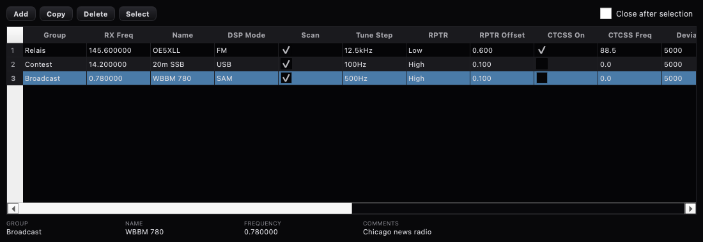

# Frequenzspeicher — Thetis' Memory-Fenster portiert

**Stand:** 20. September 2026
**Anlass:** Punkt 7 der Benchmark-Liste in
[docs/design/2026-09-17-zeus-benchmark.md](../design/2026-09-17-zeus-benchmark.md)
(„Frequenzspeicher" — Zeus' FAVORITES / „SAVE MEM"). Anders als bei den
Zeus-Ports ist hier **Thetis die Quelle**: `Memory/MemoryRecord.cs`,
`Memory/MemoryList.cs`, `Memory/MemoryForm.cs` und die Konsolen-Seite
(`RecallMemory`, Quick Save/Restore) — Thetis v2.10.3.15-5-g852bf0e.
Longpath hatte bis jetzt Bandstapel und den Tuner-Speicher, aber keinen
benannten Frequenzspeicher.

## Was gebaut wurde

| Datei | Herkunft | Inhalt |
| --- | --- | --- |
| `src/models/MemoryRecord.{h,cpp}` | **Port** `MemoryRecord.cs` + `console.cs` (Abstimmschritt-Tabelle) + `enums.cs` | Ein Speicherplatz mit den 20 Feldern und Vorgaben des Originals (Gruppe, RX-Frequenz MHz, Name, Modus, Scan, Abstimmschritt, Repeater ±/S, Versatz, CTCSS, Hub, Leistung, Split, TX-Frequenz, Filter, Grenzen, Kommentar, AGC, AGC-T); `CompareTo` → `operator<`; die 26 Abstimmschritt-Namen („1Hz" … „10MHz") ↔ Hz; Enum-Schreibweisen der XML (`FIXD/LONG/…`, `High/Simplex/Low`). |
| `src/models/MemoryList.{h,cpp}` | **Port** `MemoryList.cs` (+ Grid-Spalten aus `MemoryForm.cs`) | `memory.xml` **in Thetis' Format** (dieselben Elementnamen, dieselbe Hülle `<MemoryList><List><MemoryRecord>…`), `memory_bak.xml` nach jedem gelungenen Laden, Rückfall auf die Sicherung, `CheckVersion` 1.1; als `QAbstractTableModel` mit 20 Spalten, Häkchen-Spalten wie im Original, Zellenregel „keine Zahl → 0". Elemente, die Longpath nicht kennt (die ke9ns-Zeitplanfelder), werden mitgeführt und unverändert zurückgeschrieben. |
| `src/gui/MemoryDialog.{h,cpp}` | **Port** `MemoryForm.cs` (+ Designer-Texte) | Grid (Kombo-Zellen für Modus/Schritt/RPTR/Filter/AGC), **Add** (fängt die aktive Scheibe ein), **Copy**, **Delete** (mit Rückfrage), **Select** (Recall), „Close after selection", die Zeile mit Gruppe/Name/Frequenz/Kommentar der Auswahl; Schließen versteckt und speichert; Fensterlage gemerkt. |
| `RadioModel` | **Port** `console.cs` | `memories()` beim Bau aus `memory.xml` neben der Einstellungsdatei geladen (`MemoryList.Restore()`); `captureMemory()` = MemoryRecordAdd_Click; `recallMemory()` = RecallMemory (Frequenz, Modus, Schritt, FM: Repeater/Versatz/CTCSS, sonst Filtergrenzen, Leistung, AGC-Modus, AGC-T — und `AutoAGC` geht nur aus, wenn AGC-T abweicht, MW0LGE_21k8); `memoryQuickSave()/memoryQuickRestore()` = die Frontplatten-Knöpfe QS/QR mit `txtMemoryQuick`-Persistenz. |
| `MainWindow` | Longpath | Tools → **Memories…**, **Memory Quick Save**, **Memory Quick Restore**. |

## Abweichungen vom Original (im Quelltext markiert)

1. **Kein `Filter`-Enum.** Longpath kennt Filter als (low, high). Der
   Enum-Name bleibt als Text im Datensatz (damit die Datei mit Thetis
   austauschbar ist); Recall wendet die gespeicherten Grenzen an — bei
   jeder Vorwahl, nicht nur bei VAR1/VAR2 (bei einer Vorwahl sind es
   deren Grenzen, wie eingefangen). Beim Einfangen bekommt ein Paar, das
   einer Vorwahl des Modus entspricht, deren Namen (`F6`), sonst `VAR1` —
   was Thetis nach einer Kantenverschiebung auch speichert.
2. **Split / TX-Frequenz** werden gespeichert und angezeigt, aber nicht
   angewandt: Longpath hat keinen Split-VFO (Design 2026-05-26 §3, „split
   is replaced with XIT").
3. **FM-Hub** (`Deviation`) hat noch keine Modell-Eigenschaft in Longpath;
   der Wert wird mitgeführt, nicht angewandt.
4. **Zeitplan-Felder** (ke9ns: StartDate, Duration, Recording, Repeating,
   Repeatingm, ScheduleOn, Extra) sind nicht modelliert — Longpath hat den
   `RecordingScheduler` — reisen aber als `extras` mit.
5. **Nicht portiert:** URL-Drag-and-Drop auf „Add" (ke9ns), „Open Rec
   Folder", MP3-Wandlung, „Always on top", die FM-Speicher-Kombo der
   Frontplatte (`comboFMMemory`), Alt+M (Speichern aus der Anzeige).
6. **Speichern:** wie im Original nach jedem Add/Copy/Delete und beim
   Schließen; nicht zusätzlich beim Beenden des Programms (Thetis:
   `MemoryList.Save()` im Shutdown) — der Dialog hat da schon gespeichert.

## Prüfung

`tests/tst_memory_list.cpp` (7 Fälle): das Thetis-Beispiel aus dem
Kommentar in `MemoryForm.cs:51-71` (mit ke9ns-Feldern) parst in alle 20
Felder, die ke9ns-Elemente kommen unverändert wieder heraus, `toXml` →
`fromXml` feldgleich, Restore mit Sicherung/Rückfall/leer, Tabellenmodell
(Kopfzeilen, Zellenregel, Sortierung, Kombo-Werte), Enum-Namen und
Abstimmschritte.
`tests/tst_memory_dialog.cpp` (8 Fälle): Einfangen aus der Scheibe (mit
Vorwahl-Namen), Recall (auch die AutoAGC-Regel und unbekannte
Schrittnamen), FM-Datensatz, Quick Save/Restore, der Dialog Add → Copy →
Select → Delete (mit Bedienerhaken statt Dialogbox), `memory.xml`
geschrieben, Schließen versteckt; Grid gerendert (Bild oben, aus dem Test
mit `LONGPATH_GRAB_DIR`).

Offen: Live-Test am Radio (Speichern und Rückruf mit echter Frequenz-
und Modus-Umschaltung am Gerät).
