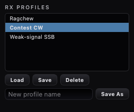

# RX-Profile — die Empfangsseite einer Scheibe unter einem Namen

**Stand:** 20. September 2026
**Anlass:** Punkt 7 der Benchmark-Liste vom 17. September („RX-Profile";
in der Funktionsmatrix: „RX-Audio-Profile — DSP-Regler als Profil
gespeichert", bei Longpath bis jetzt nur Mic-Profile für die Sendeseite).
Kein Port: nichts davon liegt als Quelltext vor; gebaut nach dem Muster
unseres eigenen `MicProfileManager`.

## Was ein Profil trägt

Die Q_PROPERTYs von `SliceModel`, die die Empfangsverarbeitung
beschreiben — 71 Stück in `RxProfileManager::profileProperties()`:

| Gruppe | Eigenschaften |
| --- | --- |
| AGC | `agcMode`, Threshold, Hang, Slope, Attack, Decay, HangThreshold, MaxGain, FixedGain, `autoAgcEnabled`, `autoAgcOffset` |
| Rauschminderung | `activeNr` und die Parameter aller Plätze: NR1 (Taps/Delay/Gain/Leakage/Position), NR2 (Gain-/NPE-Methode, Training, AE-Filter, Position, Post2), NR3, NR4 (SBNR), DFNR, BNR, MNR |
| Autonotch | `anfEnabled`, Taps, Delay, Gain, Leakage, Position |
| Störaustaster | `nbMode`, NB1-Schwelle/-Zeiten, `nb2Mode`, SNB (`snbEnabled`, K1, K2, Bandbreite) |
| Rauschsperre, APF, binaural | `ssql*`, `amsq*`, `fmsq*`, `apfEnabled`, `apfTuneHz`, `binauralEnabled` |

**Nicht** dabei: Frequenz, Modus, Filter, Schritt, AF/RF-Gain, Antennen,
RIT/XIT, Lock/Mute — das ist Sache der Frequenzspeicher (#21) bzw. des
Bandstapels. Ein Prüfstand hält die Liste sauber: jede genannte
Eigenschaft muss auf `SliceModel` existieren und schreibbar sein, und
keine der Frequenzspeicher-Eigenschaften darf darin auftauchen.

## Wie es funktioniert

`RxProfileManager` (src/core) liest die Werte über `QObject::property()`
und schreibt sie über `QMetaProperty::write()` — kein Code je Regler;
ein neuer Empfangsregler kommt ins Profil, indem sein Property-Name in
die Liste wandert. Ablage in `AppSettings`, global (nicht je Station
oder MAC — nichts davon hängt am Funkgerät):

```
RxProfile/_names            = "Contest,Ragchew"     (Manifest, Quelle der Liste)
RxProfile/active            = "Contest"             (zuletzt geladen/gespeichert)
RxProfile/<Name>/<property> = Text (bool True/False, Enums als Zahl)
```

Namen werden getrimmt und verlieren Kommas (das Manifest ist
kommagetrennt, wie beim Mic-Profil). `applyProfile` lässt Regler aus,
die im Profil fehlen (ein Regler, der erst später in die Liste kam),
und solche mit unlesbarem Wert. Die Reihenfolge der Liste ist die
Schreibreihenfolge: `activeNr` vor den NR-Parametern, `nbMode` vor den
NB-Parametern.

`RxProfilePopup` (src/gui/widgets) sitzt hinter dem ⚙ des RX-Applets
(`RxApplet::openExtendedSettings`, der Haken vom 08.09.): Liste der
Profile (das aktive fett), **Load / Save / Delete** für das gewählte,
ein Namensfeld mit **Save As** (Enter tut dasselbe). Qt::Popup wie das
Feinblatt des TX-Applets — schließt beim Klick daneben; deshalb keine
modalen Boxen von innen: der Name wird im Feld getippt, die
Löschrückfrage ist eine eingeblendete Zeile mit Yes/No.



## Entscheidungen, die ich getroffen habe (Betreiber: „mache weiter")

1. **Umfang = Verarbeitung, nicht Abstimmung** (siehe Tabelle) — was
   man beim Wechsel zwischen „Contest-CW" und „Ragchew-SSB" tatsächlich
   umstellt.
2. **Global statt je MAC** — anders als das Mic-Profil; ein Profil vom
   ANAN gilt am ANVELINA genauso.
3. **Ort: das ⚙ des RX-Applets** — die unauffälligste Stelle, kein
   neues Bedienelement im Applet selbst. Wenn ein Kombo im Applet
   gewünscht ist (wie das TX-Profil im TX-Feinblatt), ist das eine
   Gestaltungsfrage.
4. **Keine Änderungsverfolgung** („Profil geändert?" wie beim
   Mic-Profil) — Save überschreibt bewusst; das aktive Profil ist nur
   ein Merkzeichen (fett in der Liste).

## Prüfstände

* `tests/tst_rx_profile_manager.cpp` (6): Liste vollständig und
  frequenzspeicherfrei, Speichern/Anwenden mit Enums, Absagen, Umbenennen
  verschiebt Werte, Löschen räumt Manifest und aktives Profil, fehlende
  Werte lassen die Scheibe in Ruhe, Textumwandlung.
* `tests/tst_rx_profile_popup.cpp` (5): Liste + Freigaberegeln, Save As
  (Knopf und Enter), Load, Save, Löschrückfrage Yes/No, ⚙ ohne Modell,
  PNG-Grab.

**Live** in der laufenden App noch nicht geklickt (⚙ → Blatt); das Bild
oben ist aus dem Prüfstand gerendert.
