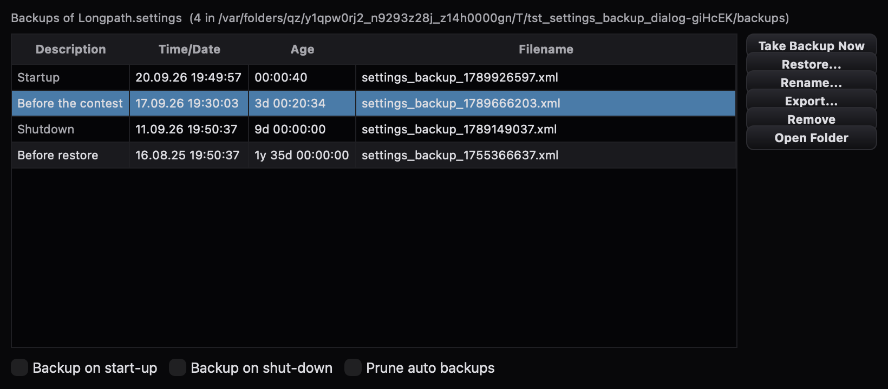

# Einstellungs-Backup — Thetis' Datenbank-Manager, die Backup-Hälfte

**Stand:** 20. September 2026
**Anlass:** Punkt 7 der Benchmark-Liste vom 17. September
(„Einstellungs-Backup"). Quelle ist Thetis: `clsDBMan.cs` und
`frmDBMan.cs` (der „Database Manager", MW0LGE) — Thetis v2.10.3.15-5-g852bf0e.
Longpaths Einstellungsdatei (`Longpath.settings`, eine XML-Datei) ist das
Gegenstück zu Thetis' `database.xml`; der Betreiber legte sich bis jetzt
Kopien von Hand daneben (`Longpath.settings.vor-rotor`,
`…vor-theme-213517`, …).

## Was gebaut wurde

| Datei | Herkunft | Inhalt |
| --- | --- | --- |
| `src/core/SettingsBackup.{h,cpp}` | **Port** `clsDBMan.cs` (Backup-Hälfte) | `takeBackup(desc, auto)` kopiert die Einstellungsdatei nach `backups/settings_backup_<Epoche>.xml` (bei Kollision `_1`, `_2`, … — `createUniqueFilename`) und schreibt daneben die JSON-Beilage `{Description, Auto}` (dieselben zwei Schlüssel wie Thetis' `BackupFileInfo`); `orderedBackups()` neueste zuerst, Beilage gelesen oder „Default"/nicht auto; `renameBackup` (Beilage neu, Auto-Flag bleibt), `removeBackups` (mit Beilage, nur innerhalb des Ordners), `exportBackup`, `restore`; `pruneForGfs()` = Thetis' Großvater-Vater-Sohn-Regel: alles der letzten 7 Tage bleibt, darüber hinaus je (Jahr, ISO-Woche) die neueste, ab 30 Tagen je Monat, ab 365 Tagen je Jahr — **gelöscht werden nur automatische Kopien** (Auto-Flag oder Beschreibung „Startup"/„Shutdown"). |
| `src/gui/SettingsBackupDialog.{h,cpp}` | **Port** `frmDBMan.cs` (Backup-Hälfte) + Designer/resx | Liste Description · Time/Date · Age · Filename (`InitBackups`, `formatTimeSpanWithYears`, `localDateTimeFormat`); **Take Backup Now** (fragt nach einer Beschreibung), **Restore…**, **Rename…**, **Export…**, **Remove** (mit Rückfrage, Ein-/Mehrzahl wie im Original), **Open Folder**; Freigaberegeln aus `lstBackups_SelectedIndexChanged` (genau eine Zeile für Restore/Rename/Export, eine oder mehr für Remove); Häkchen **Backup on start-up**, **Backup on shut-down**, **Prune auto backups** (Tooltip wörtlich aus der resx); Fensterlage gemerkt. Automatische Kopien stehen in der Zweitfarbe. |
| `src/core/AppSettings` | Longpath | `setSaveInhibited(bool)`: nach einer Wiederherstellung darf keiner der ~46 `save()`-Aufrufer die zurückgeholte Datei mehr überschreiben; gesperrte Speicherungen werden geloggt und verworfen. |
| `src/main.cpp` | Longpath | ruft `SettingsBackup::takeAutomaticBackupIfWanted(…, "Startup")` direkt nach `load()`, vor den Schema-Migrationen — also von der Datei, wie die letzte Sitzung sie hinterließ (Thetis: `LoadDB` kopiert vor `DB.Init()`, `clsDBMan.cs:370-380`). |
| `MainWindow` | Port `console.designer.cs:4125-4128`, `clsDBMan.cs:541-557`, `:975-978` | **File → Settings Backups…** (Thetis: Setup → Database Manager); **Shutdown-Kopie** (`takeAutomaticBackupIfWanted(…, "Shutdown")`) nach dem letzten `AppSettings::save()` auf beiden Beenden-Wegen (closeEvent und aboutToQuit, einmalig); nach einer Wiederherstellung: Dialog weg, Sperre setzen, Beenden über den Cmd+Q-Weg. |

## Vorgaben wie bei Thetis

`BackupOnStartup` = False, `BackupOnShutdown` = False
(`DatabaseInfo()`-Konstruktor, `clsDBMan.cs:124-125`), `PruneBackups` =
False (`:161`). Nichts passiert, bis der Betreiber es einschaltet — der
Ordner `backups/` entsteht erst mit der ersten Kopie.

## Abweichungen vom Original (im Quelltext markiert)

1. **Eine Datei statt vieler Datenbanken.** Thetis' Manager verwaltet
   mehrere Datenbanken in GUID-Ordnern (aktivieren, duplizieren,
   importieren, umbenennen). Longpath hat dafür `--profile`; portiert
   ist nur die Backup-Hälfte, gebunden an die eine Einstellungsdatei
   des laufenden Profils.
2. **Wiederherstellen = Kopie über die Datei + Beenden.** Thetis macht
   aus einer Kopie eine neue Datenbank („Make available"), aktiviert
   sie und startet sich neu. Longpath: Sicherheitskopie „Before
   restore" (manuell, wird nie ausgedünnt — wie Thetis' „Before
   container import" in `setup.cs:35183`), dann Kopie über
   `Longpath.settings`, Speichersperre, Beenden über den Cmd+Q-Weg.
   **Kein automatischer Neustart** — der Betreiber startet Longpath
   wieder; die Rückfrage sagt das vorher.
3. **Vor jeder manuellen Kopie wird gespeichert** (`setFlushHook`).
   Thetis kopiert, was auf der Platte liegt — bei Longpath wäre das
   der Stand der letzten Speicherung, nicht der von jetzt. Die
   Startup-Kopie hat keinen Hook: dort *ist* die Datei der Stand.
4. **Zeitstempel aus dem Dateinamen, nicht `CreationTime`.** Die
   Prune-Regel liest in Thetis die Erstellzeit des Dateisystems;
   ext4 kennt keine, und eine Kopie ändert sie. Die Epoche steht
   ohnehin im Namen (`getOrderedBackupFiles` liest sie so).
5. **`backups/` entsteht bei Bedarf.** Thetis legt den Ordner mit der
   Datenbank an und kopiert nicht, wenn er fehlt.
6. **Zeit/Datum als Kurzdatum + `HH:mm:ss`** (Thetis' „G"-Format der
   installierten Kultur); Exportname `Longpath_settings_export_backup_<desc>_<datum>.xml`
   nach `DateTimeStringForFile`.

## Prüfstände

* `tests/tst_settings_backup.cpp` (13): Kopie + Beilage, Flush-Hook,
  leere Beschreibung = Absage, `_1`-Suffix, Reihenfolge, „Default"
  ohne Beilage, Umbenennen behält Auto, Entfernen nur im Ordner,
  Export/Restore mit „Before restore", die Prune-Regel gegen eine
  feste Uhr (Mo 14.09.2026: 1 d/6,9 d bleiben; 8 d bleibt, 9 d/12 d
  derselben Woche gehen; 15 d allein bleibt; manuelle 40 d bleibt,
  automatische 41 d derselben Woche/desselben Monats geht; 60 d
  allein bleibt), nur automatische Kopien, Prune nach `takeBackup`,
  ISO-Woche.
* `tests/tst_settings_backup_dialog.cpp` (11): Liste, Freigaberegeln,
  Take/Rename/Remove/Export/Restore über die Bedienhaken,
  Speichersperre + `restoreCompleted`, Häkchen als True/False,
  `formatAge`, PNG-Grab.

## Live geprüft (Sandbox-Profil `backup-check`, 20.09.)

Mit `BackupOnStartup`/`BackupOnShutdown`/`PruneBackups` = True und zwei
vorgelegten automatischen Kopien (20 Tage bzw. 20 Tage + 1 h alt):
Start → `backup taken … (auto) "Startup"`, `pruned 1 automatic
backup(s)` (die ältere derselben Woche), die 20-Tage-Kopie bleibt;
SIGTERM → `backup taken … (auto) "Shutdown"`. Der Dialog ist aus dem
Prüfstand gerendert (Bild oben); der Klick auf **File → Settings
Backups…** in der laufenden App und ein Restore mit Neustart sind noch
nicht live durchgespielt.

## Was nicht portiert wurde

Der obere Teil des Managers (verfügbare Datenbanken: New, Make active,
Duplicate, Remove, Import, Rename, Export der Datenbank), der
Datenbank-Versionsabgleich (`checkVersion`), `moveToBroken`, die
Vergleichs-/Merge-Importe. Kein Kandidat davon fehlt Longpath: Profile
gibt es, Migrationen macht `AppSettings::ensureSettingsAtVersion`.
