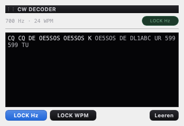

# CW-Decoder — ggmorse hinter dem Wrapper aus AetherSDR

**Stand:** 21. September 2026
**Anlass:** Punkt 3 der Benchmark-Liste („CW-Decoder"). Der erste Anlauf
(ein Port aus dem anderen Vergleichsprogramm, PR #17) wurde am 20.09. aus
Lizenz-/Namensgründen zurückgezogen; seither fehlte der Decoder wieder.
Die Upstream-Recherche vom 21.09. zeigte den sauberen Weg: **AetherSDR
dekodiert CW mit [ggmorse](https://github.com/ggerganov/ggmorse)** (Georgi
Gerganov, MIT) hinter einem 257-Zeilen-Wrapper (GPLv3, Port erlaubt —
AetherSDR-Ports sind seit Monaten Praxis, `AETHERSDR-PORTS.md`).

## Was gebaut wurde

| Datei | Herkunft | Inhalt |
| --- | --- | --- |
| `third_party/ggmorse/` | **ggmorse**, MIT, **byte-identisch** vom Original @8fb433d6 (nicht aus AetherSDRs gepatchter Kopie) | Goertzel-Tonerkennung, adaptive Schwelle, Zeichenanalyse; statische Bibliothek `ggmorse`. Provenienz: `docs/attribution/GGMORSE-PROVENANCE.md`. |
| `src/core/CwDecoder.{h,cpp}` | **Port** AetherSDR `src/core/CwDecoder.{h,cpp}` [@e944ec49] | Worker-Faden, Ring aus Mono-Float-Samples (4 s), ein zusammenhängender Parameter-Schnappschuss (Tonhöhe/Tempo-Lock, Tonband), je Aufruf genau ein ggmorse-Rahmen (1536 Samples = 32 ms bei 48 kHz), Text mit Kostenfunktion, Statistik über die Warteschlange (am Zustellzeitpunkt gelesen, nicht beim Absenden). |
| `src/core/AudioEngine` | Longpath | fünfter Abgriff `setCwTap` neben RTTY/ASR/QSO/WAV — eigener Ring, damit sich RTTY und CW beim Lesen nie stören. |
| `src/gui/applets/CwDecoderApplet.{h,cpp}` | Struktur-Ableitung von AetherSDRs CW-Bedienfeld | Text (4000 Zeichen Rückblick), Statuszeile „700 Hz · 24 WPM", Kapsel AUTO/LOCK, **LOCK Hz / LOCK WPM / Leeren**; Tonband = CW-Pitch (`AppSettings CWPitch`, Thetis-Quelle) ± 150 Hz. |
| `MainWindow` | Longpath | wie das RTTY-Applet: `registerApplet("CwDecoder")`, sichtbar nur in **CWL/CWU** (Verfügbarkeitsachse), Rebind auf jede aktive Scheibe, `m_appletsById`. |



## Abweichungen von AetherSDR (im Quelltext markiert)

1. **48 kHz Stereo-Float rein, Mono-Float raus.** AetherSDR speist 24 kHz
   Stereo und wandelt nach int16; Longpaths Abgriff liefert 48 kHz
   Float, ggmorse nimmt `GGMORSE_SAMPLE_FORMAT_F32` direkt (Resampling
   48 → 4 kHz intern, Faktor 12).
2. **Kein `setKnownParameters`** (AetherSDRs TX-seitiger Decoder mit
   bekannter Tonhöhe/Tempo aus dem Keyer) — Longpath hat keinen CW-TX.
3. **Kein Tempo-Bereich**: der ist ein AetherSDR-Patch an ggmorse selbst
   (5–115 WPM in 2-WPM-Schritten, Nordische Buchstaben). Wir vendoren das
   Original, also bleibt ggmorses eigener Suchbereich 5–55 WPM. Wer
   schneller tastet, wird nicht dekodiert — im Contest praktisch nie
   der Fall.
4. **Tonband aus dem CW-Pitch der Einstellungen**, nicht aus einem
   eigenen Regler: der Betreiber stellt seine Tonhöhe einmal ein
   (Setup), der Decoder sucht ± 150 Hz darum.
5. **Kostenschwelle fest auf AetherSDRs Vorgabe (0,70), ohne
   Empfindlichkeitsregler.** ggmorse liefert zu jedem Textstück eine
   Kostenfunktion (Abweichung der Punkt-/Strich-/Pausenlängen vom
   Ideal; unter 1,0 gilt als „dekodiert"). Bandrauschen dekodiert als
   zufällige Buchstaben mit Kosten nahe 1 — ohne Schwelle füllt sich
   das Fenster auf einer leeren CW-Frequenz mit Müll (im Livetest über
   einen KiwiSDR: 60 % aller Stücke ≥ 0,70, fast alle ≥ 0,35). Der
   Regler ist Bedienoberfläche, also Martins Entscheidung.
6. **Konfidenz als Textton, nicht als Ampel.** AetherSDR färbt nach
   Kosten grün/gelb/orange/rot; Longpath hält Rot für Warnungen frei
   (Gestaltungsregel) und dämpft stattdessen: < 0,15 Primärtext,
   < 0,35 Sekundärtext, sonst Tertiärtext. Zeilenumbrüche, die ggmorse
   bei jedem Tonhöhenwechsel setzt, werden wie bei AetherSDR zu
   Leerzeichen.

## Prüfstände

* `tests/tst_cw_decoder.cpp` (4): **ein synthetisch getastetes „CQ TEST DE
  OE5SOS" bei 700 Hz / 20 WPM / 48 kHz mit 5-ms-Flanken wird wortgleich
  dekodiert**, Tonhöhe/Tempo landen bei 700 Hz / 20 WPM; Stille dekodiert
  nichts; der Ring wirft das Älteste weg statt zu wachsen; `stop()` joint
  den Worker und löscht die nicht gesperrten Schätzwerte (gesperrte
  bleiben).
* `tests/tst_cw_decoder_applet.cpp` (6): Text landet und bleibt gedeckelt,
  Kostenschwelle/Umbrüche/Konfidenzton, Statuszeile/Kapsel folgen den
  Locks, CW-Pitch-Einstellung, Scheibe entfernt/umgebunden, PNG-Grab.

**Live geprüft (21.09., 06:55 UTC) über einen öffentlichen KiwiSDR** in
Norddeutschland (`kiwisdr.dl0hgn`, 5,195 MHz CWU, DRA5-Bake bei
Scheggerott, 15 WPM) — der ganze Weg KiwiSdrClient → 24 kHz Stereo-Float →
CwDecoder, Tonhöhe 648 Hz, 65 von 67 Textstücken unter der
Kostenschwelle 0,35:

```
I ERUPTIVE MAMAT == INDEX 19 SEP = R 11 1AGNA NA FLUX 1O1 1G MJ T1
BOULDER A 9 9 KIEL A 5 ?  IEHE ?IE DRA5
```

(„MAGNETIC" und „FLUX 101" mit Aussetzern — die Bake war nicht laut,
der Rest wortgetreu, „DRA5" sauber.) Vorher, auf 10,144/14,100 MHz an
sechs Empfängern: nur Rauschtext, weil dort kein Signal im Durchlass
war — DCF77 (77,5 kHz) als Gegenprobe stand exakt bei 650,8 Hz, 33 dB
über dem Grund, also stimmte Abstimmung und Tonweg. Dieser Versuch fand
außerdem den doppelt verschobenen CW-Durchlass des KiwiSDR-Pfads und die
fehlende Nachführung (eigener PR) und die Notwendigkeit der
Kostenschwelle (Punkt 5 oben). Am eigenen Radio (ANAN, 48-kHz-Abgriff
wie RTTY) noch nicht gehört; der Abgriff ist derselbe Weg, den der
RTTY-Decoder täglich nimmt.

## Bekanntes

ggmorse schreibt jedes dekodierte Zeichen zusätzlich auf `stdout`
(`printf` in der Rahmenanalyse). Harmlos, weil unser Text über
`takeRxData()` kommt; bewusst nicht gepatcht, damit die Byte-Identität
der Bibliothek steht.
